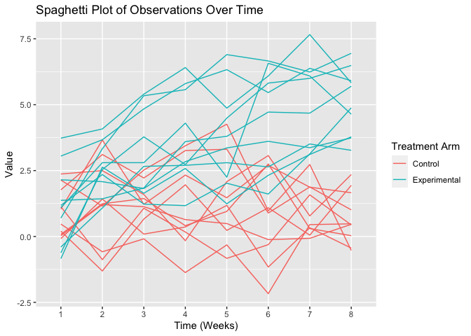

Homework Assignemnt 5 (P8105_HW5_jao2195)
================
Jennifer Osei <br>
Wednesday November 15,2023

################################################################################ 

### Problem 0

################################################################################ 

This “problem” focuses on structure of your submission, especially the
use git and GitHub for reproducibility, R Projects to organize your
work, R Markdown to write reproducible reports, relative paths to load
data from local files, and reasonable naming structures for your files.
This was not prepared as a GitHub repo.

``` r
library(tidyverse)
library(readr)
library(ggplot2)
```

################################################################################ 

### Problem 1

################################################################################ 

For this problem, we are interested in data gathered and made public by
*The Washington Post* on homicides in 50 large U.S. cities. The code
chunk below imports and cleans the data.

``` r
homicide_df = 
  read_csv("p1_data/homicide-data.csv", na = c("", "NA", "Unknown")) %>%
  mutate(
    city_state = str_c(city, state, sep = ", "),
    resolution = case_when(
      disposition == "Closed without arrest" ~ "unsolved",
      disposition == "Open/No arrest"        ~ "unsolved",
      disposition == "Closed by arrest"      ~ "solved"
    )
  ) %>% 
  filter(city_state != "Tulsa, AL") 
```

The resulting dataframe has 52178 entries, on variables that include the
victim name, race, age, and sex; the date the homicide was reported; and
the location of the homicide. In cleaning, I created a `city_state`
variable that includes both city and state, and a `resolution` variable
to indicate whether the case was closed by arrest. I also excluded one
entry in Tulsa, AL, which is not a major US city and is most likely a
data entry error.

In the next code chunk, I group within cities and summarize to produce
the total number of homicides and the number that are solved.

``` r
city_homicide_df = 
  homicide_df %>% 
  select(city_state, disposition, resolution) %>% 
  group_by(city_state) %>% 
  summarize(
    hom_total = n(),
    hom_unsolved = sum(resolution == "unsolved"))
```

Focusing only on Baltimore, MD, I can use the `prop.test` and
`broom::tidy` functions to obtain an estimate and CI of the proportion
of unsolved homicides in that city. The table below shows those values.

``` r
bmore_test = 
  prop.test(
    x = filter(city_homicide_df, city_state == "Baltimore, MD") %>% pull(hom_unsolved),
    n = filter(city_homicide_df, city_state == "Baltimore, MD") %>% pull(hom_total)) 

broom::tidy(bmore_test) %>% 
  knitr::kable(digits = 3)
```

| estimate | statistic | p.value | parameter | conf.low | conf.high | method                                               | alternative |
|---------:|----------:|--------:|----------:|---------:|----------:|:-----------------------------------------------------|:------------|
|    0.646 |   239.011 |       0 |         1 |    0.628 |     0.663 | 1-sample proportions test with continuity correction | two.sided   |

Building on this code, I can use functions in the `purrr` package to
obtain estimates and CIs for the proportion of unsolved homicides in
each city in my dataset. The code below implements this analysis.

``` r
test_results = 
  city_homicide_df %>% 
  mutate(
    prop_tests = map2(hom_unsolved, hom_total, \(x, y) prop.test(x = x, n = y)),
    tidy_tests = map(prop_tests, broom::tidy)) %>% 
  select(-prop_tests) %>% 
  unnest(tidy_tests) %>% 
  select(city_state, estimate, conf.low, conf.high) %>% 
  mutate(city_state = fct_reorder(city_state, estimate))
```

Finally, I make a plot showing the estimate (and CI) of the proportion
of unsolved homicides in each city.

``` r
test_results %>% 
  mutate(city_state = fct_reorder(city_state, estimate)) %>% 
  ggplot(aes(x = city_state, y = estimate)) + 
  geom_point() + 
  geom_errorbar(aes(ymin = conf.low, ymax = conf.high)) + 
  theme(axis.text.x = element_text(angle = 90, hjust = 1))
```

<!-- -->

This figure suggests a very wide range in the rate at which homicides
are solved – Chicago is noticeably high and, given the narrowness of the
CI, likely is the location of many homicides.

################################################################################ 

### Problem 2

################################################################################ 

This zip file contains data from a longitudinal study that included a
control arm and an experimental arm. Data for each participant is
included in a separate file, and file names include the subject ID and
arm.

#### \[Problem 2.1\] Create a tidy dataframe containing data from all participants, including the subject ID, arm, and observations over time \[Done\].

#### \[Problem 2.2\] Iterate over file names and read in data for each subject using purrr::map and saving the result as a new variable in the dataframe \[Done\].

``` r
#[Problem 2.1] - Part 1: Creating Tidy Dataframe by Listing Files to Itterate and Creating Function
  #Created a vector of all files needed from our directory using list.files() function requested.
  study_files <- list.files("data", full.names = TRUE)

  #To see the list of Study Files we have in our folder, printing stored variable above.
  study_files
```

    ##  [1] "data/con_01.csv" "data/con_02.csv" "data/con_03.csv" "data/con_04.csv"
    ##  [5] "data/con_05.csv" "data/con_06.csv" "data/con_07.csv" "data/con_08.csv"
    ##  [9] "data/con_09.csv" "data/con_10.csv" "data/exp_01.csv" "data/exp_02.csv"
    ## [13] "data/exp_03.csv" "data/exp_04.csv" "data/exp_05.csv" "data/exp_06.csv"
    ## [17] "data/exp_07.csv" "data/exp_08.csv" "data/exp_09.csv" "data/exp_10.csv"

``` r
  # Defining a function called "read_my_csv" to read data from a vector of file names, like           study_files.
    read_my_csv <- function(file_path) {
      mydata <- read_csv(file_path)
      mydata <- mutate(mydata, subject_id = str_remove(basename(file_path), "\\.csv")) #Removing        .csv suffix from file name and creating a new subject)id column with the result.
      mydata <- mutate(mydata, arm = case_when(
                                          str_detect(subject_id, "con_") ~ "Control",
                                          str_detect(subject_id, "exp_") ~ "Experimental",
                                          TRUE ~ NA_character_
                                          )) #Creating new variable called "arm". Reading in            string prefix of subject_id "con" or "exp" and making case when to have new variable with f       full name Control or Experimental.
      #creating 2 columns one for Subject Arm and the other for Subject ID from the filename. 
      return(mydata) #Function returning the modified dataset. 
    }

#[Problem 2.2] - Iteratively Importing Datasets. 
  # Use purrr::map to iterate over file names and read data for each subject using purrr::map and   saving the result as a new variable in the dataframe [Done].

  #Iterating and Storing in "List of Datasets"
  list_of_datasets <- purrr::map(study_files, ~read_my_csv(.))

##[Problem 2.1] - Part 2: Finishing Tidying Dataset for 2.1. 
  # Bind all the individual datasets into a single dataframe

  my_fully_combined_dataset <- bind_rows(list_of_datasets)

  #Re-arranging variables, tidying final cleaned up dataset.
  final_cleaned_data <- select(my_fully_combined_dataset,arm,subject_id,everything())
```

#### \[Problem 2.3\] Tidy the result; manipulate file names to include control arm and subject ID, make sure weekly observations are “tidy”, and do any other tidying that’s necessary.\[Done, please see Problem 2.1 Part 1 and Part 2, above\] <br>

The final_cleaned_data created above is the final tidy/cleaned data
Tidying and Manipulation of file names to include arm and subject_id was
completed in \[Problem 2.1 - Part\] above by: <br>

1)  Separating the file name into two columns using mutate : Subject ID
    and Arm. <br>
2)  Removing the .csv suffix from file name.<br>
3)  Weekly Observations are “tidy”; week\_# all lowercase and in same
    syntax, week_1 to week_8, across the whole datafile. Arm is “tidy”
    contains the “Control Arm or Experimental Arm”. Subject_id is “tidy”
    contains prefix of the type of arm (Con or Exp) and Subject,
    connected with an underscore. For \[subject_id\] prefix con\_ or
    exp\_ preceding the subject number (i.e. con_01 or exp_01) is
    necessary to distinguish between subject 01 in the Control Arm
    vs. Subject 01 in the Experimental Arm, thus the \[subject_id\] is
    written as such.

#### \[Problem 2.4\] Make a spaghetti plot showing observations on each subject over time, and comment on differences between groups.

``` r
##[Problem 2.4] - Creating Longitudinal Plot - Part 1: Reshaping the Dataset. 
  final_cleaned_data_long= #Creating new "long" version of the same data from our final cleaned data.
    pivot_longer(final_cleaned_data, week_1:week_8,
      names_to = "Week", 
      values_to = "Results") %>% 
      mutate(Week = str_remove(Week, "week_"))

my_longtitudinal_plot = ggplot(final_cleaned_data_long, aes(x = Week, y = Results, group = subject_id, color = arm)) +
          geom_line() +
          labs(title = "Spaghetti Plot of Observations Over Time",
              x = "Time (Weeks)",
              y = "Value",
              color = "Treatment Arm") +
              theme_grey()

my_longtitudinal_plot
```

<!-- -->

``` r
#Saving image to directory 
ggsave("images/Longtitudinal_Plot_Control_Experimental.png", 
        plot = my_longtitudinal_plot, device = "png", width = 10, height = 6, dpi = 300)
```

### Comments on differences between groups:

When looking a the Spaghetti Plot above, we can see that for the Control
Arm (Pink Color), that the results remain stable over the time around
Value of 1.5 on average, from Week 1 to Week 8, when compared to the
Experimental Arm (Teal Color).The Experimental Arm (Teal), seems to
generally trend upward over the 8 week time period from roughly a Value
of 1.5 on average to a Value of 5 on average. Overall, the Experimental
Arm has higher Values, on average than the Control Arm, with the Control
Arm remaining level around Value of 1.5 over the 8 week period and the
Experimental Arm, generally increasing its Value over the 8 week period
from 1.5 to 5.
